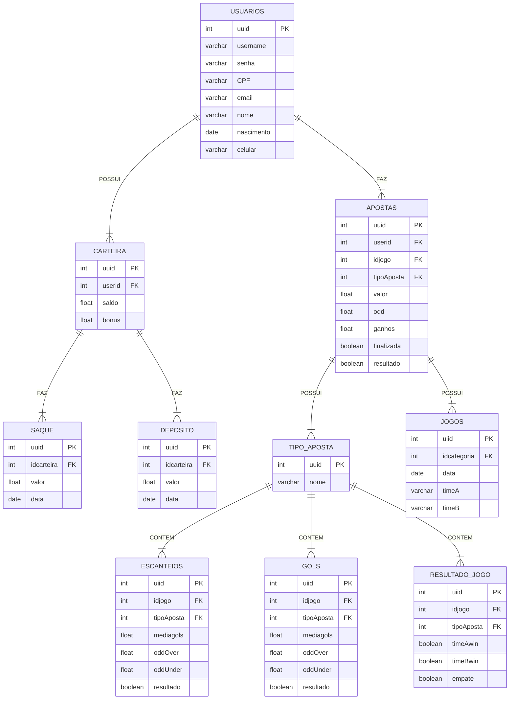

```mermaid
erDiagram
    USUARIOS ||--|{ APOSTAS : FAZ
    USUARIOS ||--|{ CARTEIRA : POSSUI
    CARTEIRA ||--|{ SAQUE : FAZ
    CARTEIRA ||--|{ DEPOSITO : FAZ
    APOSTAS ||--|{ TIPO_APOSTA : POSSUI
    APOSTAS ||--|{ JOGOS : POSSUI
    TIPO_APOSTA ||--|{ ESCANTEIOS : CONTEM
    TIPO_APOSTA ||--|{ GOLS : CONTEM
    TIPO_APOSTA ||--|{ RESULTADO_JOGO : CONTEM


    USUARIOS {
        int uuid PK
        varchar username
        varchar senha 
        varchar CPF
        varchar email
        varchar nome
        date nascimento
        varchar celular
    }
    APOSTAS {
        int uuid PK
        int userid FK
        int idjogo FK
        int tipoAposta FK
        float valor
        float odd
        float ganhos
        boolean finalizada
        boolean resultado
    }   
    CARTEIRA {
        int uuid PK
        int userid FK
        float saldo
        float bonus
    }
    SAQUE {
        int uuid PK
        int idcarteira FK
        float valor
        date data
    }
    DEPOSITO {
        int uuid PK
        int idcarteira FK
        float valor
        date data
    }
    TIPO_APOSTA {
        int uuid PK
        varchar nome
    }
    JOGOS {
        int uiid PK
        int idcategoria FK
        date data
        varchar timeA
        varchar timeB 
    }
    RESULTADO_JOGO {
        int uiid PK
        int idjogo FK
        int tipoAposta FK
        boolean timeAwin
        boolean timeBwin
        boolean empate
    }
    GOLS {
        int uiid PK
        int idjogo FK
        int tipoAposta FK
        float mediagols
        float oddOver
        float oddUnder
        boolean resultado
    }
    ESCANTEIOS {
        int uiid PK
        int idjogo FK
        int tipoAposta FK
        float mediagols
        float oddOver
        float oddUnder
        boolean resultado
    }

```