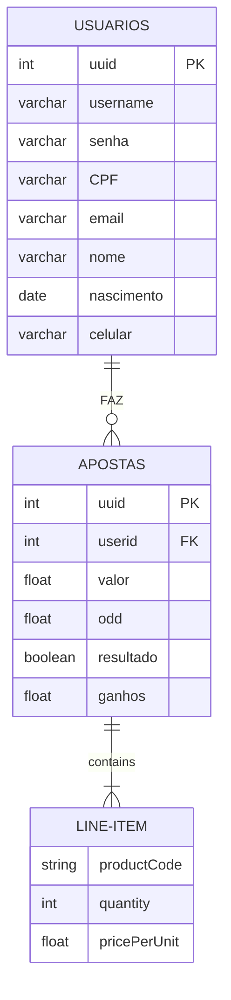

```mermaid
erDiagram
    USUARIOS ||--o{ APOSTAS : FAZ
    USUARIOS {
        int uuid PK
        varchar username
        varchar senha 
        varchar CPF
        varchar email
        varchar nome
        date nascimento
        varchar celular
    }
    APOSTAS ||--|{ LINE-ITEM : contains
    APOSTAS {
        int uuid PK
        int userid FK
        float valor
        float odd
        boolean resultado
        float ganhos
    }
    LINE-ITEM {
        string productCode
        int quantity
        float pricePerUnit
    }

```