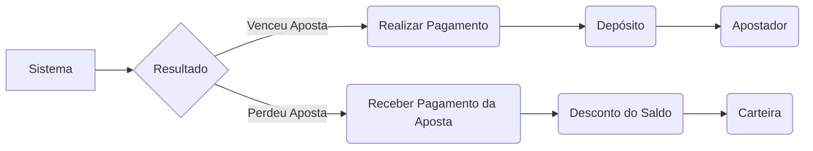

```mermaid
    flowchart LR

    A[Sistema] -->B{Resultado}
    B-->|Venceu Aposta|C(Realizar Pagamento)
    B-->|Perdeu Aposta|D(Receber Pagamento da Aposta)
    C--> E(Depósito)
    E--> G(Apostador)
    D--> H(Desconto do Saldo)
    H--> J(Carteira)
    
```